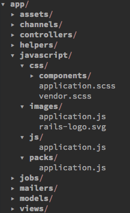

# alpha

## Getting Started

### Requirements

- ruby 2.6.0
- nodejs 10.4.0
- rails 5.2
- yarn

I recommend using `asdf` to manage ruby and nodejs versions.

### Basic Usage

```
rails new appname \
  -m https://raw.githubusercontent.com/dcrtantuco/alpha/master/template.rb
```

### Recommended Usage

```
rails new appname --database=postgresql --skip-test \
  --skip-sprockets --skip-turbolinks --skip-coffee \
  --skip-javascript --webpack \
  -m https://raw.githubusercontent.com/dcrtantuco/alpha/master/template.rb
```

## Features

- Initial folder structure if `--webpack` is enabled

  <p align="center">
    
  </p>

- Working rspec examples
- Essential packages
  - sanitize.css
- Stylelint
  - stylelint
  - stylelint-config-standard
  - stylelint-rscss
  - stylelint-8-point-grid
- Prettier
  - prettier-eslint-cli

## TODO

- Finish rspec gems setup
  - factory_bot_rails
  - database_cleaner
  - faker
  - selenium-webdriver
- Finish linters
  - Rubocop
  - Eslint
- Use `.haml`
- Improve homepage style
- Initial react setup
- Add sample js tests
- Docker setup
- Circleci config and instructions
- Add scripts for linters / CI

## License

MIT
